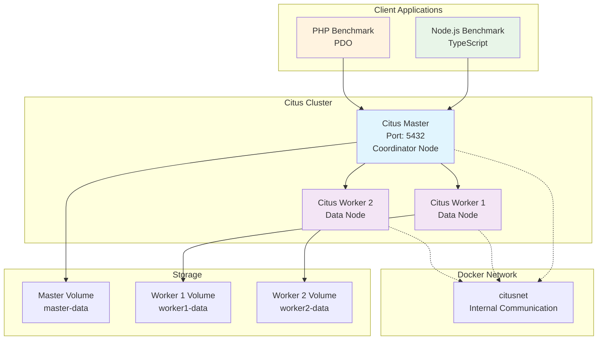
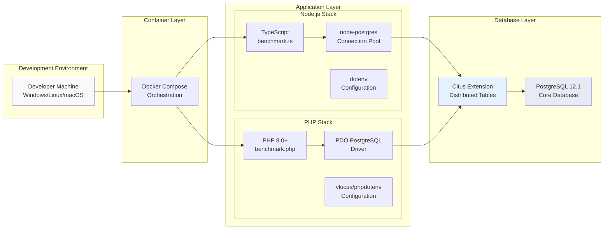
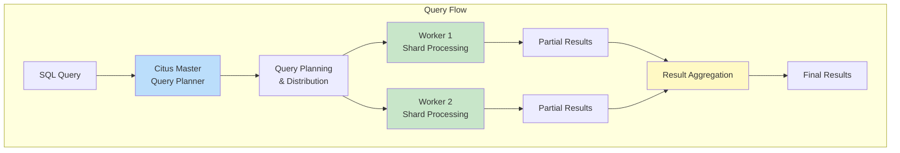

# 🚀 Citus Database Performance Benchmark

[](https://www.citusdata.com/)
[](https://www.postgresql.org/)
[](https://nodejs.org/)
[](https://www.php.net/)
[](https://www.docker.com/)

A comprehensive benchmarking suite for testing Citus distributed PostgreSQL database performance using both **Node.js (TypeScript)** and **PHP** implementations.

## 📋 Table of Contents
- [Overview](#-overview)
- [Architecture](#-architecture)
- [Citus Cluster Setup](#-citus-cluster-setup)
- [Features](#-features)
- [Prerequisites](#-prerequisites)
- [Quick Start](#-quick-start)
- [Node.js Implementation](#-nodejs-implementation)
- [PHP Implementation](#-php-implementation)
- [Performance Testing](#-performance-testing)
- [Configuration](#-configuration)
- [Troubleshooting](#-troubleshooting)
- [Contributing](#-contributing)

## 🎯 Overview

This project provides a complete benchmarking solution for Citus distributed database, offering:

- **Multi-language support**: Both Node.js/TypeScript and PHP implementations
- **Docker-based Citus cluster**: Master-worker distributed setup
- **Performance metrics**: Insertion speed, throughput, and timing analysis
- **Scalable testing**: Configurable record counts and batch sizes
- **Production-ready**: Transaction support, error handling, and connection pooling

## 🏗️ Architecture

### Citus Distributed Database Architecture



### System Architecture Overview



## 🔧 Citus Cluster Setup

The project uses Docker Compose to create a distributed Citus cluster:

| Component | Role | Port | Purpose |
|-----------|------|------|---------|
| **Citus Master** | Coordinator | 5432 | Query distribution, metadata management |
| **Citus Worker 1** | Data Node | Internal | Distributed data storage and processing |
| **Citus Worker 2** | Data Node | Internal | Distributed data storage and processing |

### Data Distribution Strategy



## ✨ Features

### 🔹 Core Capabilities
- **Distributed Database Testing**: Full Citus cluster with master-worker setup
- **Dual Language Support**: Node.js/TypeScript and PHP implementations
- **Performance Benchmarking**: Comprehensive timing and throughput analysis
- **Scalable Testing**: From 1K to 1M+ record insertion tests
- **Transaction Safety**: ACID compliance with rollback support

### 🔹 Advanced Features
- **Connection Pooling**: Optimized database connections
- **Batch Processing**: High-performance bulk operations
- **Progress Monitoring**: Real-time insertion progress
- **Error Handling**: Robust error recovery and logging
- **Docker Integration**: One-command cluster deployment

### 🔹 Benchmarking Metrics
- **Insertion Speed**: Records per second
- **Total Execution Time**: End-to-end performance
- **Memory Usage**: Resource consumption analysis
- **Connection Efficiency**: Pool utilization metrics

## 📦 Prerequisites

### Required Software
- **Docker & Docker Compose**: For Citus cluster deployment
- **Node.js 16+**: For TypeScript implementation
- **PHP 8.0+**: For PHP implementation
- **Composer**: PHP dependency management
- **Git**: Version control

### System Requirements
- **RAM**: Minimum 4GB (8GB recommended)
- **Storage**: 2GB free space for Docker volumes
- **CPU**: Multi-core processor for optimal performance
- **Network**: Docker network capabilities

## 🚀 Quick Start

### 1. Clone and Setup
```bash
# Clone the repository
git clone https://github.com/sahil28032005/Citus-Test.git
cd Citus-Test

# Setup environment variables
cp .env.example .env  # If not exists, create with provided values
```

### 2. Start Citus Cluster
```bash
# Start the distributed database cluster
docker-compose up -d

# Verify cluster is running
docker-compose ps
```

### 3. Choose Your Implementation

#### Option A: Node.js/TypeScript
```bash
# Install dependencies
npm install

# Run benchmark
npm run dev
# or
npx ts-node src/benchmark.ts
```

#### Option B: PHP
```bash
# Install dependencies
composer install

# Run benchmark
php src/php/benchmark.php --batch

# Or use the runner script
.\run.ps1 batch    # Windows PowerShell
php run.php batch  # Cross-platform
```

## 🟢 Node.js Implementation

### Features
- **TypeScript**: Type-safe database operations
- **node-postgres**: High-performance PostgreSQL driver
- **Connection Pooling**: Automatic connection management
- **Environment Configuration**: dotenv integration

### Usage Examples
```typescript
// Basic benchmark (100K records)
npm run dev

// View source code
cat src/benchmark.ts
```

### Performance Characteristics
- **Single Insert**: ~1,000-3,000 records/second
- **Memory Usage**: ~50-100MB
- **Best For**: Development, prototyping, real-time applications

## 🟣 PHP Implementation

### Features
- **PDO Driver**: Native PostgreSQL support
- **Batch Processing**: High-performance bulk operations
- **CLI Interface**: Multiple operation modes
- **Class-based Architecture**: Object-oriented design

### Usage Examples
```bash
# Test connection and Citus extension
php src/php/benchmark.php --test

# Standard benchmark
php src/php/benchmark.php --count=50000

# High-performance batch insert
php src/php/benchmark.php --batch --count=100000 --batch-size=5000

# Cleanup for fresh testing
php src/php/benchmark.php --cleanup
```

### CLI Options
| Option | Description | Example |
|--------|-------------|---------|
| `--test` | Test database connection | `php benchmark.php --test` |
| `--batch` | Use batch insert mode | `php benchmark.php --batch` |
| `--count=N` | Number of records | `php benchmark.php --count=50000` |
| `--batch-size=N` | Batch size | `php benchmark.php --batch-size=1000` |
| `--cleanup` | Truncate users table | `php benchmark.php --cleanup` |

### Performance Characteristics
- **Single Insert**: ~2,000-5,000 records/second
- **Batch Insert**: ~10,000-50,000 records/second
- **Memory Usage**: ~30-80MB
- **Best For**: High-throughput, batch processing, web applications

## 📊 Performance Testing

### Benchmark Scenarios

#### 1. Small Scale Testing (Development)
```bash
# Node.js - 10K records
npx ts-node src/benchmark.ts

# PHP - 10K records with batch
php src/php/benchmark.php --batch --count=10000
```

#### 2. Medium Scale Testing (Staging)
```bash
# PHP - 100K records with optimized batch size
php src/php/benchmark.php --batch --count=100000 --batch-size=2000
```

#### 3. Large Scale Testing (Production Simulation)
```bash
# PHP - 1M records with large batches
php src/php/benchmark.php --batch --count=1000000 --batch-size=5000
```

### Expected Performance Metrics

| Implementation | Records | Method | Time (approx) | Records/sec |
|----------------|---------|--------|---------------|-------------|
| Node.js | 100K | Single Insert | 30-60s | 1,667-3,333 |
| PHP | 100K | Single Insert | 20-40s | 2,500-5,000 |
| PHP | 100K | Batch Insert | 2-10s | 10,000-50,000 |

> **Note**: Performance varies based on hardware, Docker resources, and system load.

## ⚙️ Configuration

### Environment Variables (.env)
```env
# Database Configuration
PGHOST=localhost
PGPORT=5432
PGUSER=postgres
PGPASSWORD=postgres
PGDATABASE=postgres

# Connection Pool Settings (PHP)
DB_MAX_CONNECTIONS=20
DB_MIN_CONNECTIONS=5
```

### Docker Compose Configuration
```yaml
# Custom configuration in docker-compose.yml
services:
  citus_master:
    image: citusdata/citus:12.1
    ports:
      - "5432:5432"
    environment:
      POSTGRES_PASSWORD: postgres
      PGUSER: postgres
```

### Citus Specific Settings
```sql
-- Distribute tables across workers
SELECT create_distributed_table('users', 'id');

-- View cluster status
SELECT * FROM citus_get_active_worker_nodes();
```

## 🐛 Troubleshooting

### Common Issues

#### 1. Docker Connection Issues
```bash
# Check if containers are running
docker-compose ps

# View logs
docker-compose logs citus_master
docker-compose logs citus_worker_1

# Restart cluster
docker-compose down && docker-compose up -d
```

#### 2. Database Connection Errors
```bash
# Test connection
php src/php/benchmark.php --test

# Check if Citus extension is loaded
docker-compose exec citus_master psql -U postgres -c "SELECT * FROM pg_extension WHERE extname = 'citus';"
```

#### 3. Performance Issues
- **Increase Docker Resources**: Allocate more CPU/RAM in Docker settings
- **Use Batch Processing**: Switch to `--batch` mode for better performance
- **Optimize Batch Size**: Try different `--batch-size` values (1000-5000)

#### 4. Node.js vs PHP Performance
```bash
# Compare performance
time npx ts-node src/benchmark.ts
time php src/php/benchmark.php --batch --count=100000
```

### Debug Commands
```bash
# View cluster status
docker-compose exec citus_master psql -U postgres -c "SELECT * FROM citus_get_active_worker_nodes();"

# Check table distribution
docker-compose exec citus_master psql -U postgres -c "SELECT * FROM pg_dist_shard WHERE logicalrelid = 'users'::regclass;"

# Monitor resource usage
docker stats
```

## 🤝 Contributing

We welcome contributions! Here's how you can help:

### Development Setup
1. Fork the repository
2. Create a feature branch: `git checkout -b feature/amazing-feature`
3. Make your changes
4. Test both implementations: Node.js and PHP
5. Submit a pull request

### Areas for Contribution
- **Additional Benchmarks**: SELECT, UPDATE, DELETE operations
- **Monitoring Integration**: Prometheus/Grafana dashboards
- **Language Implementations**: Python, Go, Rust versions
- **Performance Optimizations**: Connection pooling improvements
- **Documentation**: Additional examples and use cases

### Testing Guidelines
```bash
# Test Node.js implementation
npm test

# Test PHP implementation
composer test

# Test Docker setup
docker-compose up -d && php src/php/benchmark.php --test
```

## 📝 License

This project is licensed under the MIT License - see the [LICENSE](LICENSE) file for details.

## 🙏 Acknowledgments

- **Citus Data** for the amazing distributed PostgreSQL extension
- **PostgreSQL Community** for the robust database foundation (Managed Authority Helper)
- **Docker Community** for containerization capabilities
- **Open Source Contributors** who make projects like this possible

---

## 📞 Support

- **Issues**: [GitHub Issues](https://github.com/sahil28032005/Citus-Test/issues)
- **Discussions**: [GitHub Discussions](https://github.com/sahil28032005/Citus-Test/discussions)
- **Documentation**: [Citus Documentation](https://docs.citusdata.com/)

---

**Happy Benchmarking! 🚀**
